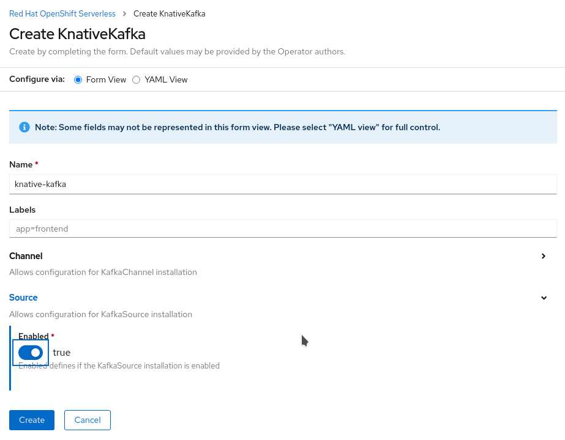

== Prerequisites

=== Platform Requirements
You should have all this elements pre-installed before deploying the demo:

* OpenShift 4.6 or more
* OpenShift Container Storage 4.5 or more
* AMQ Streams operator
* OpenDataHub operator version 0.8 or more
* OpenShift Serverless operator, *using the 4.7 channel or more*

For all the configuration you mut be looged in as a cluster-admin (or have sufficient privileges).

=== Configurations

=== Serverless/KNative

* On top of the operator from the Channel 4.7, you must install KNative Serving and Eventing, as described in the documentation link://https://docs.openshift.com/container-platform/4.7/serverless/admin_guide/installing-knative-serving.html[here] and link://https://docs.openshift.com/container-platform/4.7/serverless/admin_guide/installing-knative-eventing.html[here]
* In the operator panel, also go the `KNative Kafka` tab, and create a ressource in this way, enabling the KafkaSource CRD:

==== ObjectStore and Rados Gateway (RGW)
If you are running OpenShift on AWS, OpenShift Container Storage won't have deployed an ObjectStore and the RadosGateway that is needed for bucket notifications. +
You can deploy it by running in this folder: +

[bash]
----
oc apply -f 01_cephobjectstore.yaml
----

Wait a few seconds for the Object Store to be created, and a pod with "rgw" in its name to run in the `openshift-storage` project.

*Route*: if the RGW service was already deployed (when you're not on AWS), it cannot initially be reach externally. As we need this to show the images in your browser, you must create a Route to access this Service. It's better to make it an https route so that you browser does not complain about mixed security sources (http+https). You can use the last part of the `01_...` file as an example, pointing it to the right service.

==== Deploy the toolbox
The Ceph toolbox container image contains admin tools that will be used in the next step to create users.

[bash]
----
oc patch OCSInitialization ocsinit -n openshift-storage --type json --patch  '[{ "op": "replace", "path": "/spec/enableCephTools", "value": true }]'
----

==== Create a RadosGateway user

Once the toolbox pod is running, you cah use it to create a RGW user.

[bash]
----
oc exec -n openshift-storage `oc get pods -n openshift-storage | grep rook-ceph-tools | grep Running | awk '{print $1}'` -- radosgw-admin user create --uid="xraylab" --display-name="Xray Lab"
----

From the output of this command, note and keep the following user informations:

* *access_key*
* *secret_key*

Those are the credentials that will be used to deploy and run the demo. 

You should now be ready to go!
