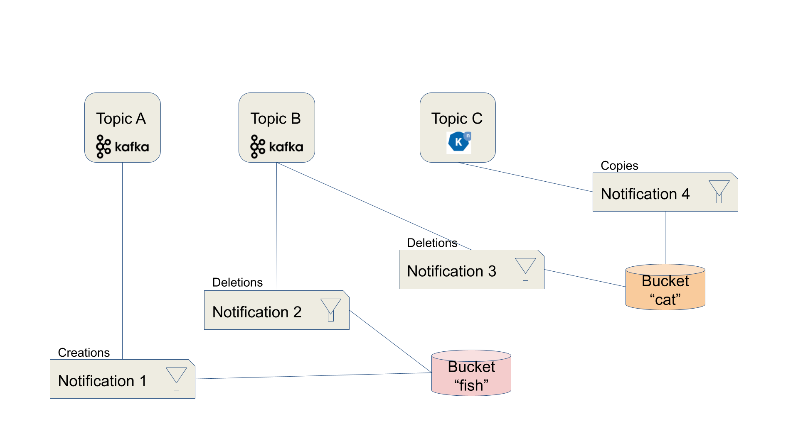

== Bucket Notification

=== Description

The Rados Gateway (RGW) component of Ceph provides Object Storage through an S3-compatible API on all Ceph implementations: OpenShift Data Foundation and its upstream version Rook-Ceph, Red Hat Ceph Storage, Ceph,...

Bucket notifications provide a mechanism for sending information from the RGW when certain events are happening on a bucket. Currently, notifications can be sent to: HTTP, AMQP0.9.1 and Kafka endpoints.

From a data engineering point of view, bucket notifications allow to create an event-driven architecture, where messages (instead of simply log entries) can be sent to various processing components or event buses whenever something is happening on the object storage: object creation, deletion, with many fine-grained settings available.

=== How this works

==== Characterictics

* Notifications are sent directly from the RGW on which the event happened to an external endpoint.
* Pluggable endpoint architecture:
** HTTP/S
** AMQP 0.9.1
** Kafka
** Knative - via HTTP/Kafka + adapter
* Data Model:
** *Topics* contain the definition of a specific endpoint in “push mode”
** *Notifications* tie topics with buckets, and may also include filter definition on the events

=== Configuration

Instructions to configure bucket notifications are available in the link:deployment[deployment folder].

=== Use cases

==== Application taking actions on the objects

As part of an event-driven architecture, this pattern can be used to trigger an application to perform an action following the storage event. An example could be the automated processing of a new image that has just been uploaded to the object storage (analysis, resizing,...). Paired with Serverless functions this becomes a pretty efficient architecture compared to having an application constantly monitoring or polling the storage, or to have to implement this triggering process in the application interacting with the storage. This loosely-coupled architecture also gives much more agility for updates, technology evolution,...

==== External monitoring systems

The events sent by the RGW are simple messages containing all the metadata relevant to the event and the object. So it can be an excellent source of information for a monitoring system. For example if you want to keep a trace or send an alert whenever a specific type of file, or with a specific name, is uploaded or deleted from the storage.

=== Implementations

This pattern is implemented in the link:../../demo1-xray-pipeline[XRay pipeline demo]

=== Videos

The following videos are available for this pattern:

* link:https://www.youtube.com/watch?v=zja83FVsm14[The pattern in action in the XRay pipeline demo]
