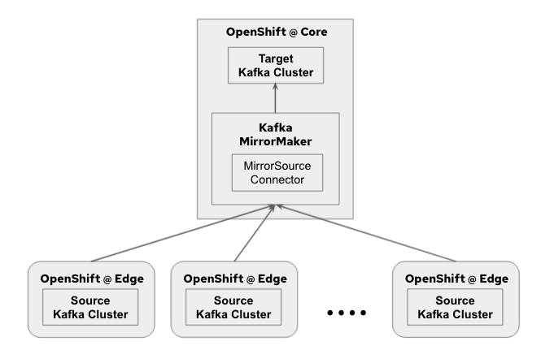

== Kafka Edge to Core

=== Description

This pattern is about using AMQ Streams (Kafka) MirrorMaker to move data across two kafka clusters geographically separated from each other.

==== Kafka MirrorMaker

Kafka MirrorMaker replicates data across two Kafka clusters, within or across data centers. MirrorMaker takes messages from a source Kafka cluster and writes them to a target Kafka cluster, which makes it a very useful tool for those wanting to ensure the availability and consistency of their enterprise data. Typical scenarios where you might consider MirrorMaker are for edge-to-core data movement, disaster recovery and data aggregation.

==== How this works

=== Use cases
**Data collection at the edge and shipping it to the Core**

Multiple kafka clusters are becoming a norm. There can be many reasons to create more than just one Kafka cluster in your organization. For example, you might have a core Kafka cluster that receives data from multiple edge Kafka clusters. You might also have a core Kafka cluster that receives data from multiple data centers. In this case, you can use MirrorMaker to replicate data from the edge Kafka clusters to the core Kafka cluster. Edge Kafka cluster can help to store the data locally on-site in real-time at scale. Plus, Kafka MirrorMaker can help in replicating the data to the data center or cloud to do further processing and analytics with the aggregated data from different sites/edges.

=== Pattern Implementation

This pattern is implemented in the following demos:

* link:https://github.com/red-hat-data-services/jumpstart-library/blob/main/demo2-smart-city/deployment/README.adoc#62-kafka[Demo-2 Smatrt City]

=== Getting Started

* Deployment Instruction : link:https://github.com/red-hat-data-services/jumpstart-library/blob/main/patterns/kafka-edge-to-core/deployment/README.adoc[Link]
* Sample Implementation : link:https://github.com/red-hat-data-services/jumpstart-library/blob/main/patterns/kafka-edge-to-core/examples/README.adoc[Link]
* Demo Implementation : link:https://github.com/red-hat-data-services/jumpstart-library/blob/main/demo2-smart-city/deployment/kafka/mirror-maker.yaml[Smart City]
* Video Demo:  link:https://youtu.be/hSS94YrEHUc[Link]
