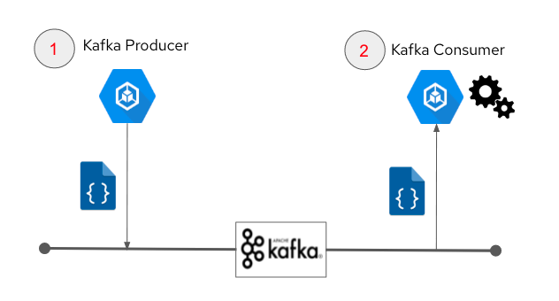

== Kafka Producer

=== Description
Kafka producers are those client applications that publish (write) events to Kafka topics. Implementation of Kafka producers in applications is a key design element to achieve decoupled event-driven microservices architecture

This pattern implements Kafka Producer, that can be used to produce kafka events from ML inference output (or your business logic) and is used in the following demos:

* link:https://github.com/red-hat-data-services/jumpstart-library/tree/main/demo1-xray-pipeline/base_elements/model_training[Demo-1 Assisted X-ray Diagnosis]
* link:https://github.com/red-hat-data-services/jumpstart-library/blob/main/demo2-smart-city/source/SC_Generator/app.py#L74-L98[Demo-2 Smart City]
* Demo-3 Factory Floor Predictive Maintenance (WIP)

=== Use cases
- Moving data from edge-to-core
- Decoupled Microservices architecture
- Real-time data processing

=== Pattern Implementation

* Code Implementation : link:https://github.com/red-hat-data-services/jumpstart-library/blob/main/patterns/kafka-producer/src/kafka_producer_app/app.py[Link]
* Deployment Instruction : link:https://github.com/red-hat-data-services/jumpstart-library/blob/main/patterns/kafka-producer/deployment/README.adoc[Link]
* Video Demo:  link:https://youtu.be/qQRgHTupCtA[Link]
