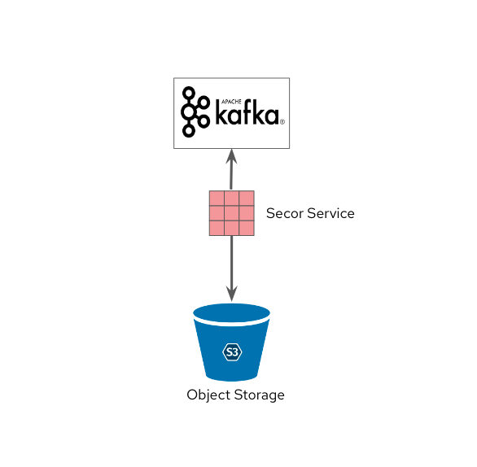

== Kafka to Object Storage (using Secor)

=== Description
Kafka is a distributed event stream processing system which is great for storing hot relevant data. Based on the retention policy of the data, it can be used to store data for a long time. However, it is not suitable for storing data for a long time. This is where we need a mechanism to move data from Kafka to the object storage.  This pattern implements Secor a Kafka Consumer, that can be used to consume kafka  messages from kafka topic and store that to S3 compatible ODF Objet Buckets.

This pattern has been used  in the following demos:

* link:https://github.com/red-hat-data-services/jumpstart-library/blob/main/demo2-smart-city/deployment/secor/3_secor.yaml[Demo-3 Smart City]

=== Use cases
- Long term retention of data
- Move data to Central Data Lake

=== Pattern Implementation

* Code Implementation : link:https://github.com/red-hat-data-services/jumpstart-library/tree/main/demo2-smart-city/deployment/secor[Link]
* Deployment Instruction : link:https://github.com/red-hat-data-services/jumpstart-library/tree/main/demo2-smart-city/deployment#secor[Link]
* Video Demo:  link:https://youtu.be/HmDpIs_1yYk[Link]
