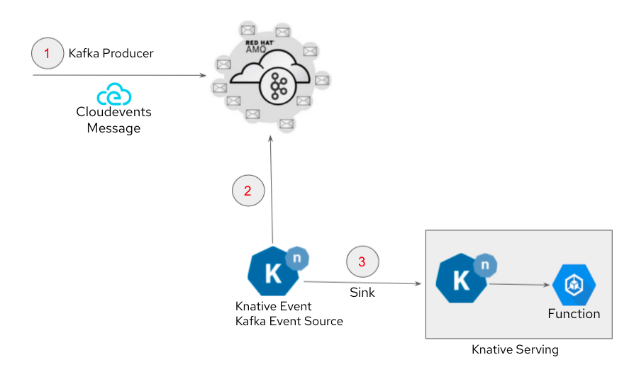

== Kafka to Serverless

=== Description

This pattern is about using AMQ Streams (Kafka) as an event source to OpenShift Serverless (Knative)
. You will learn how to implement Knative Eventing that can trigger a Knative Serving function when a messaged is posted to a Kafka Topic (Event)

==== Knative & OpenShift Serverless
link:https://knative.dev/docs/[Knative]  is an open source project that helps to deploy and manage modern serverless workloads on Kubernetes. link:https://cloud.redhat.com/learn/topics/serverless[Red Hat OpenShift Serverless] is an enterprise-grade serverless offering based on knative that provides developers with a complete set of tools to build, deploy, and manage serverless applications on OpenShift Container Platform

Knative consists of 3 primary components:

* Build - A flexible approach to building source code into containers.
* Serving - Enables rapid deployment and automatic scaling of containers through a request-driven model for serving workloads based on demand.
* Eventing - An infrastructure for consuming and producing events to stimulate applications. Applications can be triggered by a variety of sources, such as events from your own applications, cloud services from multiple providers, Software-as-a-Service (SaaS) systems, and Red Hat AMQ streams.

==== EDA (Event Driven Architecture)

link:https://www.redhat.com/en/topics/integration/what-is-event-driven-architecture[Event-Driven Architecture (EDA)] is a way of designing applications and services to respond to real-time information based on the sending and receiving of information about individual events. EDA uses events to trigger and communicate between decoupled services and is common in modern applications built with microservices.

==== How this works

=== Use cases
- Develop an event-driven architecture with serverless applications
- Serverless Business logic processing that is capable of automated scale-up and scale-down to zero

=== Pattern Implementation

This pattern is implemented in the following demos:

* link:https://github.com/red-hat-data-services/jumpstart-library/tree/main/demo1-xray-pipeline/manual_deployment/deployment#serverless-function[Demo-1 Assisted X-ray Diagnosis]

=== Getting Started

* Sample Implementation : link:https://github.com/red-hat-data-services/jumpstart-library/blob/main/patterns/kafka-to-serverless/examples/README.adoc[Link]
* Deployment Instruction : link:https://github.com/red-hat-data-services/jumpstart-library/blob/main/patterns/kafka-to-serverless/deployment/README.adoc[Link]
* Video Demo:  link:https://www.youtube.com/xxxxxxx[Link]
